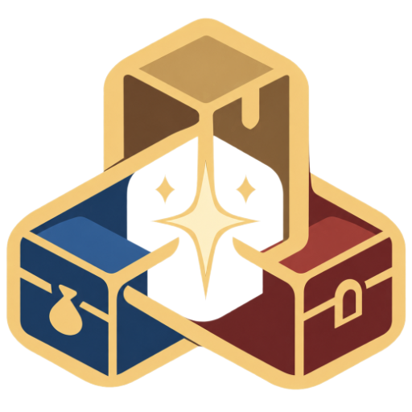

<p align="center"></p>

<h1 align="center">Bagcheck</h1>

<p align="center"><strong>A crafter's shopping list and retainer tracker for Final Fantasy XIV. It keeps count; you do the shopping.</strong></p>

Bagcheck is a Dalamud plugin that keeps track of what you need for your crafts and what you already have. It
shows what's still missing, where it's cheapest on your data centre, and roughly what finishing the list would
cost. It also remembers your retainers' gil and market listings.

**Bagcheck has no automation.** It never clicks, buys, sells, moves your character or opens a window for you. It
only reads what you already have open in game, and asks [Universalis](https://universalis.app) for prices.

## Shopping List

- **Add items three ways:** search by name or item id, right-click an item in your bags and choose
  **Add to Shopping List**, or paste a list from Teamcraft.
- **Teamcraft import.** Press "Copy as text" on a panel in Teamcraft and paste it in. Raw materials are ticked for
  you, and things you'd normally craft are left unticked. Paste again later to update the amounts.
- **Need, have, still need.** What you hold is counted across your bags, crystals, saddlebag and retainers. Hover
  over the count to see where it is and how recently each place was seen.
- **Groups.** Each import becomes a group, and you can make your own. Pause a group you're not working on yet.
- **HQ or any quality**, per item. Any quality counts HQ too.

## Prices

- **Check prices** looks up everything still needed across your data centre and shows the cheapest way to buy
  it, which worlds it's on, and the price on the world you're on.
- **Target prices.** Give an item the most you'd like to pay and Bagcheck shows whether anything is listed at or
  under it.
- **NPC vendors.** If an NPC sells it for less, you're told who and where.
- **The total.** About how much gil finishing the list would take, with the market's 5% tax estimated.

## Retainers

- Each retainer's gil and how many market slots it's using, noted when you open a summoning bell.
- Each retainer's listings, noted when you open its market.
- **Check prices** compares your listings with your home world and shows which have been undercut. Your own
  retainers never count as competition.

## Installation

Bagcheck will be available from Looneth's Dalamud plugin repository. Once it's listed:

1. In game, open `/xlsettings`.
2. Under **Experimental > Custom Plugin Repositories**, add this URL and save:

   ```text
   https://ey4o.github.io/XIV-Plugins/repo.json
   ```

3. Open `/xlplugins`, then find and install **Bagcheck**. A short welcome guide opens the first time.

## Commands

| Command | What it does |
| --- | --- |
| `/bagcheck` | Open Bagcheck |
| `/bagcheck settings` | Open the settings |
| `/bagcheck welcome` | Open the welcome guide |

## Building

You need the .NET 10 SDK and a Dalamud dev environment (XIVLauncher with Dalamud installed).

```text
dotnet build Bagcheck.slnx -c Release
dotnet test tests/Bagcheck.Core.Tests
```

The plugin is written to `src/Bagcheck/bin/Release/Bagcheck`.

## Licence

[MIT](LICENSE).
